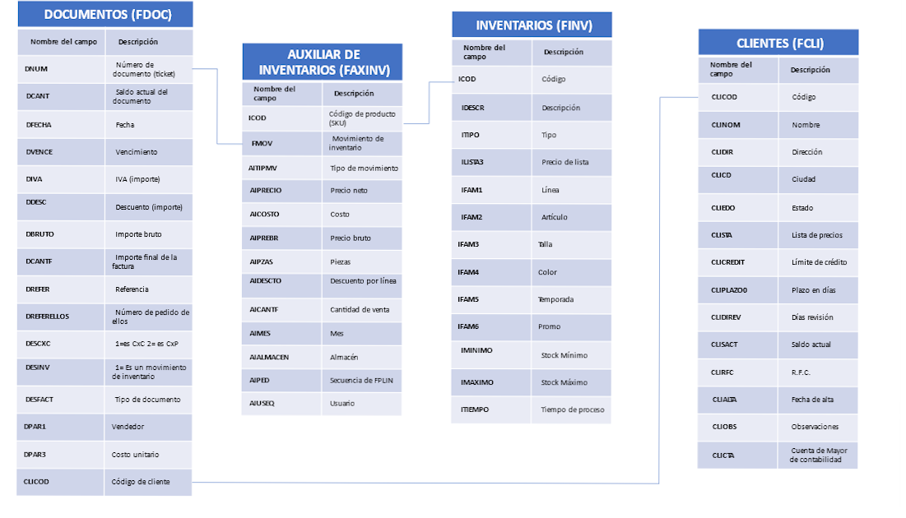

# Instrucciones para Crear un Query de Ventas

## Instrucciones
Con el diagrama de base de datos compartido, crea un query para obtener la información de ventas del cliente, incluyendo los siguientes campos:

- **# de ticket**
- **Fecha**
- **Monto (DCANT) con y sin IVA**
- **Vendedor**
- **Cliente**
- **Productos comprados (SKU)**
- **Descripción**
- **Cantidad (unidades)**
- **Almacén que vendió**
- **Precio de lista**
- **Talla**
- **Color**
- **Temporada**

## Resolucion
Primero se crea la vista con la consulta requerida para un facil acceso posterior, tambien permite recuperar dicha informacion de multiples registros a aplicar clausulas WHERE

Para comprobar la solucion cremos un base de datos my_db, creamos los modelos y con mysql.connector los ejecutamos, creamos la vista y ejecutamos el codigo recibiendo la informacion en un diccionario 